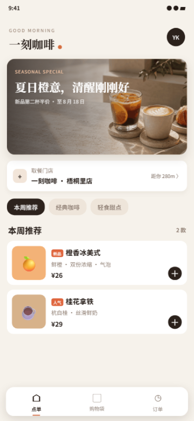

# 一刻咖啡｜精品点单小程序样例

面向咖啡、茶饮、烘焙和轻餐饮门店的精品点单体验。样例强调品牌视觉、低学习成本的选购路径，以及从商品规格到订单状态的完整闭环。

## 核心卖点

- 品牌化首页、活动主视觉和门店取餐信息
- 商品分类、推荐标签、规格与糖度/温度选择
- 购物袋数量调整、金额汇总和确认下单
- 订单状态、取餐进度和历史记录管理
- 本地持久化，刷新或重新打开后仍保留订单数据
- 原生微信小程序实现，无第三方运行时依赖

## 交付内容

- 33 秒演示视频：[demo.mp4](./demo.mp4)
- 关键页面截图：[screenshots](./screenshots/)
- 功能规格：[feature-spec.md](./feature-spec.md)
- 演示讲解词：[demo-script.md](./demo-script.md)
- 测试报告：[test-report.md](./test-report.md)
- 验收清单：[acceptance-checklist.md](./acceptance-checklist.md)
- 可导入源码：`source.zip`

## 技术方案

- 技术栈：WXML、WXSS、JavaScript、微信 Storage
- 页面结构：单页面多业务状态，底部导航切换点单、购物袋和订单
- 数据策略：样例数据与交易状态保存在本地，便于离线演示
- 工程特点：零 npm 依赖、主包小、导入即运行

## 本地运行

1. 解压 `source.zip`。
2. 在微信开发者工具中选择“小程序”并导入解压目录。
3. 使用测试号或替换 `project.config.json` 中的 AppID。
4. 点击“编译”，从首页开始体验点单流程。

正式商用通常需要继续接入商品后台、门店管理、库存、会员、优惠券、支付、订单通知和打印系统。

