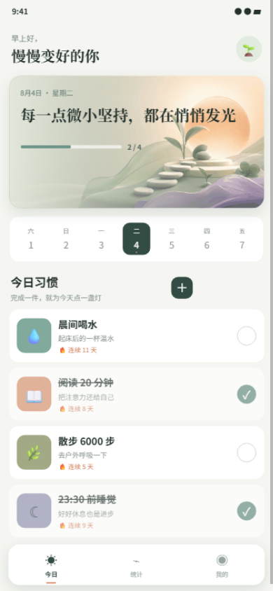

# 微光习惯｜习惯打卡小程序样例

面向健康、自律、教育、成长陪伴和企业员工关怀场景的轻量习惯产品。样例把每日行动、趋势反馈和习惯管理组织成清晰闭环。

## 核心卖点

- 温和克制的健康视觉和每日激励文案
- 今日习惯、完成进度、连续天数与震动反馈
- 自定义习惯名称、图标和颜色
- 周趋势、月度坚持、完成率和最佳记录
- 个人习惯管理、删除和示例数据恢复
- 本地持久化，重新打开后保留自定义内容

## 交付内容

- 33 秒演示视频：[demo.mp4](./demo.mp4)
- 关键页面截图：[screenshots](./screenshots/)
- 功能规格：[feature-spec.md](./feature-spec.md)
- 演示讲解词：[demo-script.md](./demo-script.md)
- 测试报告：[test-report.md](./test-report.md)
- 验收清单：[acceptance-checklist.md](./acceptance-checklist.md)
- 可导入源码：`source.zip`

## 技术方案

- 技术栈：WXML、WXSS、JavaScript、微信 Storage
- 页面结构：今日、统计和我的三种业务状态
- 数据模型：习惯、完成状态、连续天数、图标预设和统计展示
- 工程特点：原生轻量、无 npm 依赖、导入即运行

正式项目可继续接入账号同步、提醒通知、云端统计、排行榜、课程计划或企业管理后台。

